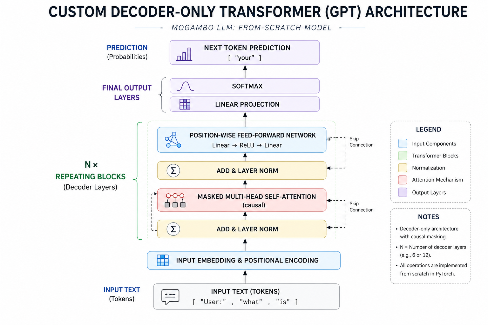

# 🤖 Mogambo LLM — Custom Generative Transformer from Scratch

[](https://pytorch.org/)
[](https://flask.palletsprojects.com/)
[](https://www.python.org/)
[](https://opensource.org/licenses/MIT)

> *"Most developers call an OpenAI API. Some fine-tune a Hugging Face wrapper. I decided to write the math."*

**Mogambo LLM** is an end-to-end, locally trained Generative Pre-trained Transformer (GPT) built entirely from scratch in PyTorch.  
It includes a custom Multi-Head Self-Attention engine, handcrafted Byte-Pair Encoding (BPE) tokenizers, an automated multi-source dataset compiler, and a sleek responsive web UI powered by Flask.

---

## 🏛️ Project Showcase

### 1. Inference Interface
*Premium developer-style UI with a dark navy foundation and neon cyan accents.*


### 2. Second UI View
*Another look at the interactive chatbot experience.*


### 4. Transformer Architecture
*Standard decoder-only transformer layout mapped to custom tensor operations.*



---

## 🧠 The Two Brains

This repository contains two distinct model versions: **The Heavyweight Generalist** and **The Artisanal Specialist**.

| Metric | 🥊 Mogambo-140M (The Titan) | 🎯 Mogambo-Pure (The Specialist) |
| :--- | :--- | :--- |
| **Primary Goal** | Broad English comprehension & reasoning | Strong persona-focused responses |
| **Parameter Count** | ~140 Million | ~5 Million |
| **Checkpoint Size** | 408.2 MB (`Mogambo-140M.pt`) | 19.8 MB (`mogambo_pure.pt`) |
| **Embedding Dim (d_model)** | 768 | 256 |
| **Attention Heads** | 12 | 8 |
| **Decoder Layers** | 12 | 6 |
| **Context Window** | 256 tokens | 128 tokens |
| **Vocabulary Size** | 16,000 (BPE Master) | 2,000 (BPE Micro) |
| **Training Corpus** | ~250,000 mixed instruction pairs | 320 handcrafted Q&A pairs |

> **Note:**  
> **Mogambo-140M (The Titan)** and **Mogambo-Pure (The Specialist)** were trained on a relatively small dataset, so the models have certain limitations.  
> They may perform well on short, familiar, and persona-based responses, but their understanding and generation quality can still be limited for larger, more complex, or highly diverse tasks.
> Due to the large size of the Mogambo-140M.pt model file, I am not able to upload it directly to GitHub.
---

## 📚 The 250k Master Ingestion Pipeline

To give the 140M model a broad baseline of human language, a custom ingestion pipeline (`download_all_data.py`) combines multiple open-source datasets into one normalized text format:

1. **`OpenRL/daily_dialog`** *(11k+ turns)* — casual multi-turn conversational rhythm.
2. **`Ahren09/empathetic_dialogues`** *(25k+ turns)* — emotional subtext and empathetic replies.
3. **`Bitext Customer Support LLM`** *(27k+ turns)* — clean customer support style conversations.
4. **`tatsu-lab/alpaca`** *(52k+ turns)* — instruction-following for logic, math, and code.
5. **`Custom Persona Corpus`** *(320 turns)* — personalized identity vectors like *“My owner is Sumit Mali”* and *“Mogambo khush hua”*.

---

## ⚡ Compute & Training Performance

Training a 140M parameter model locally from scratch required serious compute discipline.

- **Total Training Time:** ~39 hours of continuous execution

---

## 🚀 Quickstart Guide

### Prerequisites
- Python 3.10 or 3.11
- PyTorch (CUDA/XPU recommended, but CPU works for `Mogambo-Pure`)

### 1. Clone the repository
```bash
git clone https://github.com/Sumit07125/Transformer_Mogambo_LLM.git
cd Transformer_Mogambo_LLM
